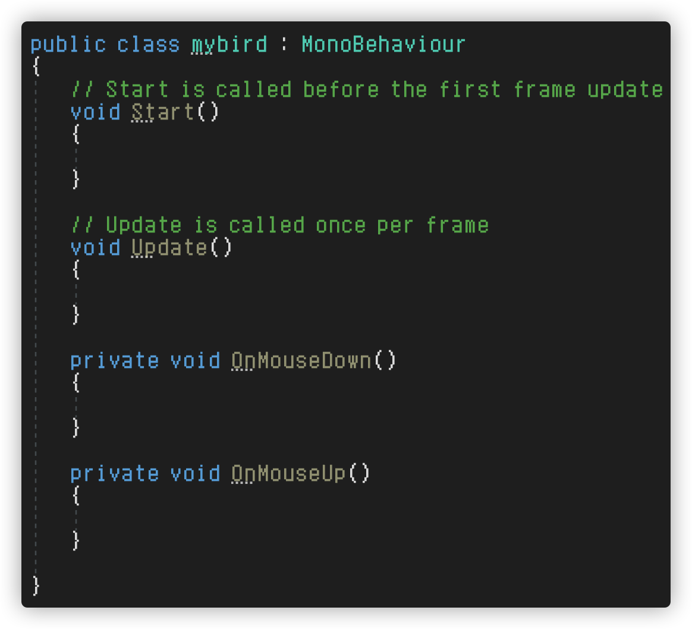

# 给小鸟添加脚本

创建脚本文件，重写OnMouseDown和OnMouseUp方法



```c#
public class mybird : MonoBehaviour
{

    // 是否处于拖拽状态
    bool isInDragging = false;

    // 代表锚点，需要创建一个空对象，并将它移动到锚点和属性值上
    public Transform anchorTrans;

    public float maxDistance = 5f;

    SpringJoint2D springJoint2D;

    Rigidbody2D rigidbody2D;

    // 释放鼠标后延迟小鸟的发射
    public float releaseDelaySecond = 0.1f;

    // Start is called before the first frame update
    void Start()
    {
        springJoint2D = GetComponent<SpringJoint2D>();
        rigidbody2D = GetComponent<Rigidbody2D>();
    }

    // Update is called once per frame
    void Update()
    {
        if (isInDragging)
        {
            // 让小鸟跟随鼠标指针移动
            transform.position = Camera.main.ScreenToWorldPoint(Input.mousePosition);
            transform.position = new Vector3(transform.position.x, transform.position.y, 0);
            // 判断小鸟的距离是否超出了最大距离
            if(Vector3.Distance(transform.position, anchorTrans.position) > maxDistance)
            {
                // 限制小鸟出界
                Vector3 direction = (transform.position - anchorTrans.position).normalized*maxDistance;
                transform.position = anchorTrans.position + direction;
            }
        }
    }

    private void OnMouseDown()
    {
        isInDragging = true;
        // 防止释放后力道过猛
        rigidbody2D.isKinematic = true;
    }

    private void OnMouseUp()
    {
        isInDragging = false;
        rigidbody2D.isKinematic = false;
        StartCoroutine(ReleaseBird());
    }

    // 创建协程来延迟小鸟的发射
    IEnumerator ReleaseBird()
    {
        yield return new WaitForSeconds(releaseDelaySecond);
        // 禁用弹力关节
        springJoint2D.enabled = false;
    }

}
```


