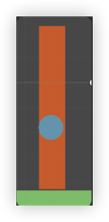
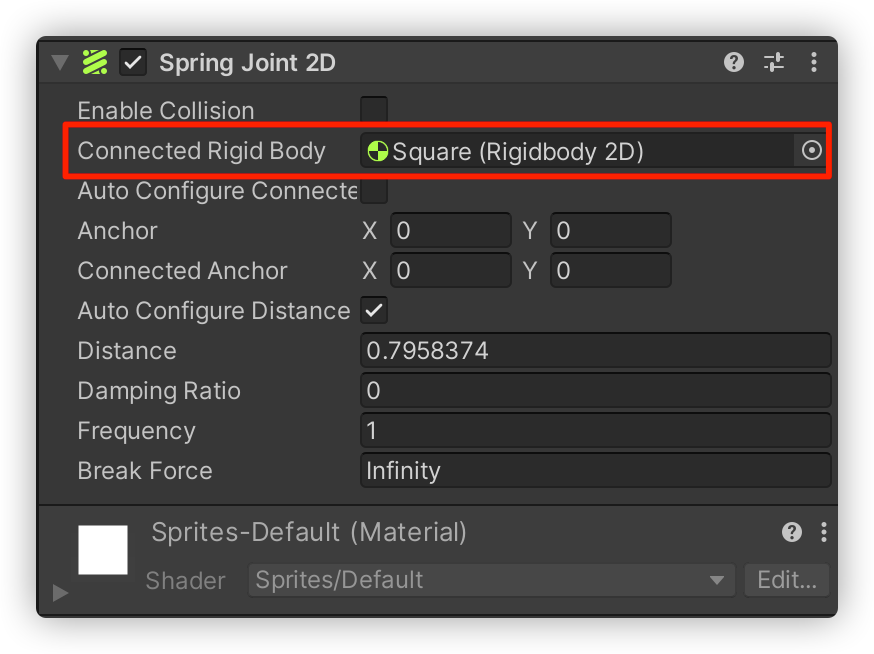
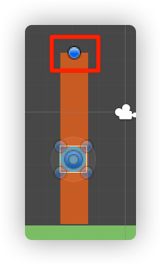
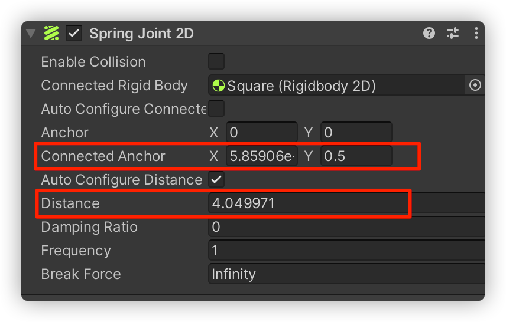

# 课后总结
1. 如何布置图片素材的内外层级关系？
2. 学习并运用“2D弹簧关节（Spring Joint 2D）”组件
3. 让精灵跟随鼠标指针移动
4. 如何限制精灵跟随鼠标移动的范围
5. 如何在小鸟碰撞到猪时让猪消失
### 1.如何布置图片素材的内外层级关系？
Inspector → Sprite Render → Additional Settings → Order in Layer

### 2. 学习并运用“2D弹簧关节（Spring Joint 2D）”组件
2D 弹簧关节组件：允许由刚体物理组件控制的两个游戏对象就像通过弹簧连接在一起一样。弹簧将在两个对象之间沿轴线施力，试图使这两个对象保持一定距离。



给地面，球，柱子都添加上刚体，2D盒型碰撞体，另外给球添加2D弹簧关节。



在Connected Rigid Body（已连接刚体）选项中，将柱子拖进去。



此时会出现一个锚点，将锚点拖拽到合适位置。



拖拽过程中这两行参数会实时改变。

运行后发现球与锚点之间像是有一根弹簧绳一样牵引在一起。

### 3. 让精灵跟随鼠标指针移动
①：在Update中不断获取当前鼠标所在的世界空间点的值。
Input.mousePosition：获取当前鼠标的像素坐标位置。
Camera.main.ScreenToWorldPoint：将屏幕空间点转换为世界空间点。

②：重新设置transform组件的位置。

```c#
// 让精灵跟随鼠标指针移动
Vector3 vector3 = Camera.main.ScreenToWorldPoint(Input.mousePosition);
transform.position = new Vector3(vector3.x, vector3.y, 0);
```

### 4. 如何限制精灵跟随鼠标移动的范围
①：获取精灵与锚点的距离。
方法：Vector3.Distance(Vector3 a, Vector3 b)

②：如果距离大于规定的最大距离，则进行限制处理。
```c#
// 将规定的最大距离maxDistance转换为Vector3对象
Vector3 maxVector3 = maxDistance  * (monoBehaviour.transform.position 
	- anchorTrans.position).normalized ;
// 设置在超出范围时显示的位置
monoBehaviour.transform.position = anchorTrans.position + maxVector3;
```

### 5. 如何在小鸟碰撞到猪时让猪消失
```c#
// 碰撞检测处理
private void OnCollisionEnter2D(Collision2D collision)
{
    // 检测猪的运动速度
    if(collision.relativeVelocity.magnitude > maxVelocity)
    {
        // 销毁猪
        Destroy(this.gameObject);
    }
}
```
① Collision2D.relativeVelocity：两个碰撞物体的相对线性速度，返回值是Vector2类型。

② Vector2.magnitude：返回这个Vector2的长度。
也就是当猪和小鸟在碰撞时产生的运动速度大于规定的maxVelocity时销毁猪。

③ MonoBehaviour.Destroy：移除一个游戏对象，组件或资源。

### 6. 理解刚体类型RigidbodyType2D

RigidbodyType2D
解释：
Rigidbody2D 的物理行为类型。

控制 Rigidbody2D 的物理行为，包括它应如何移动、对力作出反应以及与物理模拟的其余部分交互。


变量：

Dynamic      将 Rigidbody2D 设置为具有动态行为。

Kinematic   将 Rigidbody2D 设置为具有运动行为。

Static       将 Rigidbody2D 设置为具有静态行为。

```c#
// 在OnMouseDown中调用
public void doInOnMouseDown()
{
    isInDragging = true;
    // 当鼠标控制住对小鸟时，应该设置其为运动行为，防止释放后力道过猛
    rigidbody2D.isKinematic = true;
}
```


